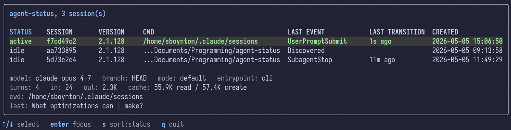

# agent-status

A hook collector and live status board for local coding-agent sessions.



## Install

### Release tarball
```sh
curl -L https://github.com/samling/agent-status/releases/latest/download/agent-status_<version>_linux-amd64.tar.gz | tar xz
sudo install agent-status_*/agent-status /usr/local/bin/
```

### From source
```sh
go install github.com/samling/agent-status/cmd/agent-status@latest
```

### Build it yourself
```sh
git clone https://github.com/samling/agent-status.git
cd agent-status
make install
```

## How It Works

AI agents like Claude Code and Codex support [hooks](https://code.claude.com/docs/en/hooks) that enable users to execute actions at various points in the agent's lifecycle (new session, prompt submitted, tool used, etc.). We configure the agent hooks to execute a [script](./scripts/post-agent-status.sh) to POST the event to the collector (`agent-status server`). The collector receives those events over local HTTP and persists per-session state. Agent state files and databases are also checked for locally to discover live sessions and reap stale ones. Clients (the TUI `agent-status ui`, `agent-status statusline`, `agent-status focus <session_id>`) read live state through the collector's `GET /state` HTTP endpoints, so the daemon is the single source of truth.

The data read by `agent-status` is **local** and **only data provided by the supported agents**. **Nothing ever leaves your machine.** `agent-status` uses the _presence_ of certain files (e.g. `~/.claude/sessions/*.jsonl`) to infer the existence of sessions; it uses the _contents_ to provide information on that session (model name, agent version, a preview of the last submitted prompt). This data already exists unencrypted on your machine; poke around `~/.claude`, `~/.codex` etc. if you're curious. Absolutely no data is collected by me from service nor will it ever be. A non-exhaustive list of data and locations checked includes:

- Claude Code hook payloads (event-specific data - prompt submitted, tool used, session started/ended, awaiting input, etc.)
- Claude Code data in `~/.claude`, specifically `sessions` and `projects` (session-specific data - model used, creation date, current session status, etc.)
- Codex hook payloads (event-specific data - prompt submitted, tool used, session started/ended, awaiting input, etc.)
- Codex data in `~/.codex`, specifically `state_*.sqlite`, `logs_*.sqlite`, and `sessions` (session-specific data - model used, creation date, current session status, etc.)
  - `shell_snapshots/` is checked for the presence of a session file as it's currently the only way I've found to determine when a new Codex session is started _before_ sending the first message

This tool aggregates that data, tracks state by agent and session id, and presents it in a terminal UI.

## Compatability

I made this tool for me initially, which means I've prioritized my own use cases first. It builds for ARM and so I presume it will work there too.

> **Note on arm64:** the SQLite driver is `modernc.org/sqlite` (pure Go, no CGo) so cross-compilation stays simple, but it is meaningfully slower than the CGo-based driver on arm64. Personal use is fine; if you ever pin this against larger Codex state databases on an arm64 host and notice query latency, that's the trade-off.

The mechanism to bring focus to active sessions (called "activating a window") varies greatly across OSes, desktop environments and sometimes applications. I primarily work in tmux and using the VSCode extension in CLI mode, so those were my initial targets. It has limited or (more likely) no support (yet) for other DEs/compositors.

| OS            | Shell/DE/Compositor | Supported  | Notes |
| ---           | ---                 | ---        | ---   |
| Windows (WSL) | Windows Shell       | ✅        | Can focus VSCode and VSCode-variant host applications from WSL terminal |
| Linux         | tmux                | ✅        | Can focus tmux panes directly |
|               | niri                | ✅        | Can focus other windows running claude-code |
|               | hyprland            | ⛔        |   |
|               | gnome               | ⛔        |   |
|               | kde                 | ⛔        |   |
|               | others              | ⛔        |   |
| MacOS         | MacOS               | ⛔        |   |


## Setup

> **Requirements:** `jq make`

The fastest path, from a clone of this repo:

```sh
make bootstrap
```

`scripts/bootstrap.sh` configures Claude Code and Codex and will:

1. Copy `scripts/post-agent-status.sh` to each agent config dir.
2. Render `hooks/claude-code.json` and `hooks/codex.json` with the absolute path to the forwarder.
3. Merge the rendered Claude Code hooks into `~/.claude/settings.json` and Codex hooks into `~/.codex/hooks.json`. If a file already exists, the merge leaves a `.bak` next to the original.

Set `CLAUDE_CONFIG_DIR` to point bootstrap at a different config directory.
Set `CODEX_HOME` if your Codex config directory lives somewhere other than `~/.codex`.

### Manual setup

If you don't want to run the script, do it by hand:

```sh
mkdir -p ~/.claude/scripts
cp scripts/post-agent-status.sh ~/.claude/scripts/
sed -i "s|path-to-post-agent-status|$HOME/.claude/scripts/post-agent-status.sh|g" hooks/claude-code.json
```

Copy/merge the contents of `hooks/claude-code.json` into `~/.claude/settings.json`

For Codex:

```sh
mkdir -p ~/.codex/scripts
cp scripts/post-agent-status.sh ~/.codex/scripts/
sed "s|path-to-post-agent-status|$HOME/.codex/scripts/post-agent-status.sh|g" hooks/codex.json > ~/.codex/hooks.json
```

## Configure

Configuration is stored in `$XDG_CONFIG_HOME/agent-status/config.yaml`. On most systems `XDG_CONFIG_HOME=$HOME/.config`.

The state file is stored in `$XDG_STATE_HOME/agent-status/state.json`. On most systems `XDG_STATE_HOME=$HOME/.local/state`.

## Run

Start the server:

```sh
agent-status server
```

Open the UI:

```sh
agent-status ui
```

See `agent-status -h` and subcommand `-h` output for configuration.

### Run the collector as a user service

A reference systemd user unit lives at `contrib/systemd/user/agent-status.service`. To install it:

```sh
make install-service
systemctl --user enable --now agent-status
```

Or by hand:

```sh
mkdir -p ~/.config/systemd/user
cp contrib/systemd/user/agent-status.service ~/.config/systemd/user/
systemctl --user daemon-reload
systemctl --user enable --now agent-status
```

The unit assumes `agent-status` is on `PATH` at `/usr/bin/agent-status`. Edit `ExecStart=` if yours lives elsewhere (e.g. `~/go/bin/agent-status`).

### Launch from a tmux popup

Bind the UI to a tmux popup so it overlays the current pane and dismisses itself once you focus a session (requires `tmux >= 3.2` for popup support):

```tmux
set-hook -g session-created 'if -F "#{==:#{session_name},agent-status}" "set-option -t agent-status status off"'

bind o if-shell -F "#{==:#{session_name},agent-status}" {
  detach-client
} {
  display-popup -E "tmux new-session -A -s agent-status 'agent-status ui --quit-after-focus'"
}
```

The `--quit-after-focus` flag exits the TUI after `enter` focuses a session, which lets `display-popup -E` close the popup automatically. Omit the flag if you'd rather the popup stay open until you press `q`.

## Logging

Logging is `log/slog`-based and gated by `LOG_LEVEL` (or `log.level`
in config / `--log-level`). Set `LOG_FORMAT=json` for machine-friendly
output.

## Develop

```sh
make build      # bin/agent-status
make test       # go test ./...
make clean
```
