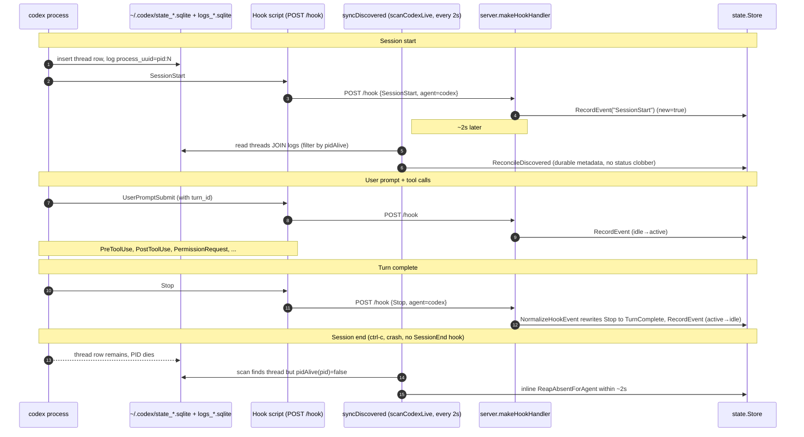

# Session Lifecycle: Per-Agent Workflow

Two sequence diagrams, one per supported agent, in parallel layout so the
differences pop out. Both flows converge on `state.Store`, which is the
single source of truth consumed by the TUI, statusline, `state` CLI, and
the notify watcher.

## Claude Code

```mermaid
sequenceDiagram
  autonumber
  participant CC as claude-code process
  participant SF as ~/.claude/sessions/<pid>.json
  participant HK as Hook script (POST /hook)
  participant FS as watchClaudeFiles (fsnotify)
  participant POLL as syncDiscovered (2s poll, backstop)
  participant SRV as server.makeHookHandler
  participant ST as state.Store

  Note over CC,ST: Session start
  CC->>SF: create (pid, sessionId, status=idle)
  SF-->>FS: fsnotify Create/Write
  FS->>ST: ApplyDiscovered (insert row, jsonl_status=idle)
  CC->>HK: SessionStart
  HK->>SRV: POST /hook {SessionStart}
  SRV->>ST: RecordEvent("SessionStart")

  Note over CC,ST: User prompt + tool calls
  CC->>SF: status=busy
  SF-->>FS: fsnotify Write
  FS->>ST: ApplyDiscovered jsonl_status=busy (idle→active)
  CC->>HK: UserPromptSubmit
  HK->>SRV: POST /hook
  SRV->>ST: RecordEvent (no transition; status pinned by JSONL)
  Note over CC,HK: PreToolUse, PostToolUse, Notification, PermissionRequest, ...

  Note over CC,ST: Turn complete
  CC->>HK: Stop
  HK->>SRV: POST /hook
  SRV->>ST: RecordEvent("Stop")
  CC->>SF: status=idle
  SF-->>FS: fsnotify Write
  FS->>ST: ApplyDiscovered jsonl_status=idle (active→idle)

  Note over CC,ST: Session end
  CC->>SF: delete
  SF-->>FS: fsnotify Remove
  FS->>ST: scanClaudeLive + ReapAbsentForAgent(claude-code)
  CC->>HK: SessionEnd (sometimes arrives AFTER the reap)
  HK->>SRV: POST /hook {SessionEnd}
  SRV->>ST: RecordEvent -> applied=false (no-op, logged DEBUG)

  Note over POLL,ST: Backstop (always running)
  POLL->>ST: every 2s: ApplyDiscovered + inline ReapAbsentForAgent
```

## Codex



## Key contrasts

The asymmetry between the two flows comes from what each agent exposes
locally:

- Claude has a per-session JSON file, so we get fsnotify-driven status
  updates and a fast deletion-driven reap (claude-only re-scan). Codex
  has only shared SQLite, so everything goes through the 2 s poll.
- Claude emits a `SessionEnd` hook (sometimes); codex doesn't. The
  inline reap inside `syncDiscovered` is the only way we learn that
  codex exited.
- Claude exposes a busy/idle JSONL status; codex doesn't, so codex's
  derived status comes purely from `LastEvent`. For claude, `deriveStatus`
  pins to `idle` whenever JSONL says idle, so user-prompt-style hooks
  don't flip the status until JSONL flips to busy. The one exception is
  `PermissionRequest`, which forces `waiting` even over `JSONL=idle`
  because the engine going idle while a permission prompt is open just
  means "blocked on user."
- Both share the same `RecordEvent` / `Sessions` / `ReapAbsentForAgent`
  paths in `state.Store`, so anything downstream (TUI, statusline,
  notify) is agent-agnostic.

## Adding a new agent

A new agent slots into this picture by adding a `liveSource` entry in
`internal/discovery/discovery.go`:

- `scan` is required: returns the live sessions found in the agent's
  local state files (one read every 2 s).
- `watch` is optional: spawn a fast-path watcher (analogous to
  `watchClaudeFiles`) when the agent has per-session files we can hook
  fsnotify into. Agents without one rely on the poll.

Hook payloads from the new agent reach `state.Store` through the same
`POST /hook` path as the existing agents; tag them with `agent=<name>`
in the URL or the JSON body so `inferAgent` resolves them correctly.
