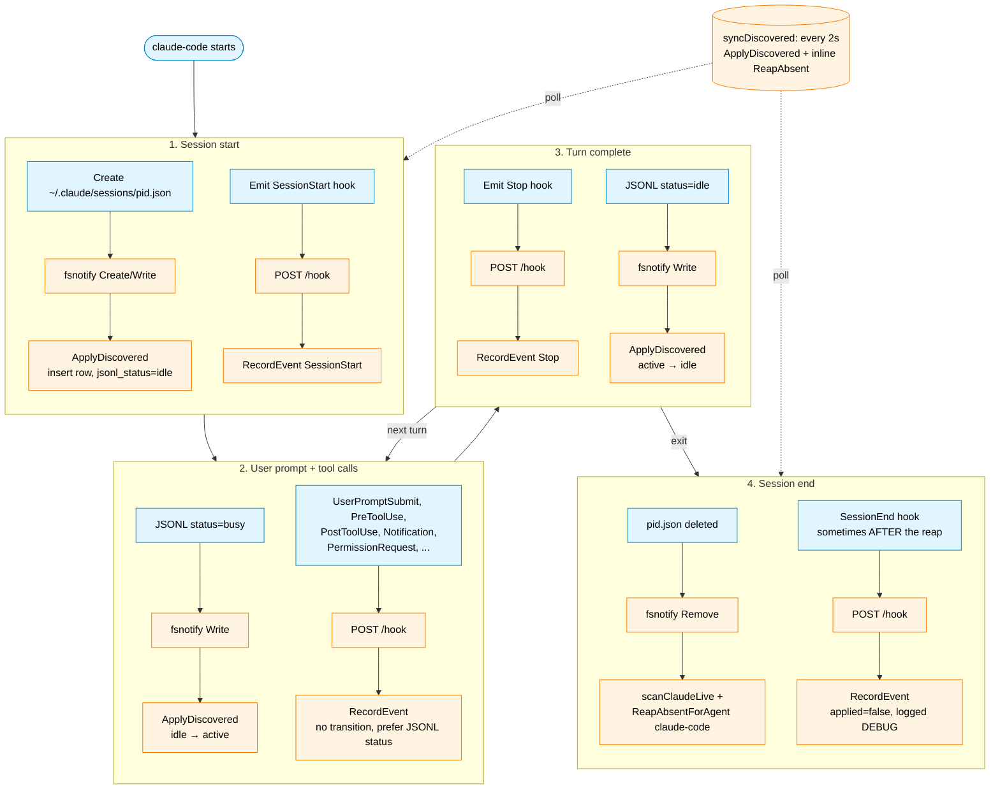
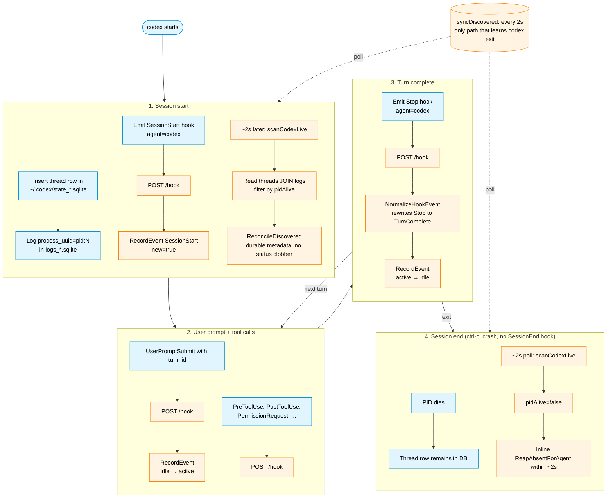

# Session Lifecycle: Per-Agent Workflow

Two top-down flowcharts, one per supported agent, with each lifecycle
phase as its own subgraph so the differences pop out. Both flows
converge on `state.Store`, which is the single source of truth consumed
by the TUI, statusline, `state` CLI, and the notify watcher.

## Claude Code

Blue nodes are actions taken by the `claude-code` process (or its files
on disk); orange nodes are agent-status components (fsnotify watcher,
hook server, `state.Store`, poller).

## Codex

Blue nodes are actions taken by the `codex` process (or its SQLite
files); orange nodes are agent-status components (hook server,
`state.Store`, poller).

## Key contrasts

The asymmetry between the two flows comes from what each agent exposes
locally:

- Claude has a per-session JSON file, so we get fsnotify-driven status
  updates and a fast deletion-driven reap (claude-only re-scan). Codex
  has only shared SQLite, so everything goes through the 2 s poll.
- Claude emits a `SessionEnd` hook (sometimes); codex doesn't. The
  inline reap inside `syncDiscovered` is the only way we learn that
  codex exited.
- Claude exposes a busy/idle JSONL status; codex doesn't, so codex's
  derived status comes purely from `LastEvent`. For claude, `deriveStatus`
  pins to `idle` whenever JSONL says idle, so user-prompt-style hooks
  don't flip the status until JSONL flips to busy. The one exception is
  `PermissionRequest`, which forces `waiting` even over `JSONL=idle`
  because the engine going idle while a permission prompt is open just
  means "blocked on user."
- Both share the same `RecordEvent` / `Sessions` / `ReapAbsentForAgent`
  paths in `state.Store`, so anything downstream (TUI, statusline,
  notify) is agent-agnostic.

## Adding a new agent

A new agent slots into this picture by adding a `liveSource` entry in
`internal/discovery/discovery.go`:

- `scan` is required: returns the live sessions found in the agent's
  local state files (one read every 2 s).
- `watch` is optional: spawn a fast-path watcher (analogous to
  `watchClaudeFiles`) when the agent has per-session files we can hook
  fsnotify into. Agents without one rely on the poll.

Hook payloads from the new agent reach `state.Store` through the same
`POST /hook` path as the existing agents; tag them with `agent=<name>`
in the URL or the JSON body so `inferAgent` resolves them correctly.
